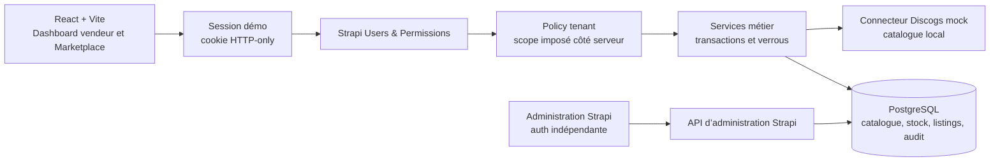
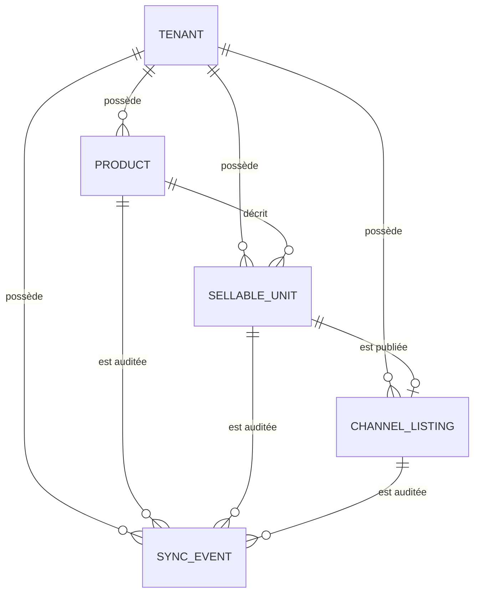
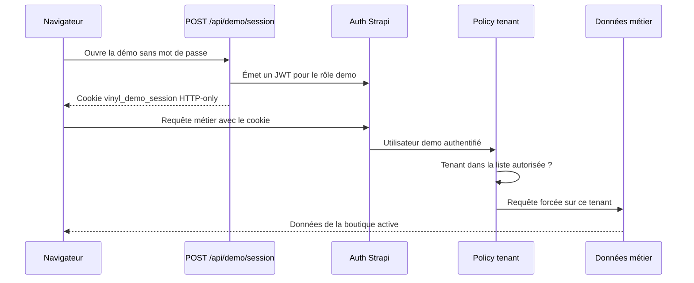

# Needle — backoffice vinyle multi-tenant

Démo complète d’un backoffice de disquaire construit avec Strapi 5, PostgreSQL, React et
TypeScript. Elle montre deux boutiques réellement isolées, un catalogue illustré, des
exemplaires physiques avec SKU et un workflow Marketplace entièrement simulé.

La démo est volontairement accessible sans mot de passe, mais les routes métier ne sont pas
publiques : le navigateur ouvre d’abord une session Strapi limitée aux deux tenants de
démonstration.

## Ce que la démo permet de vérifier

| Sujet         | Comportement                                                                       |
| ------------- | ---------------------------------------------------------------------------------- |
| Multi-tenant  | Sélecteur entre **Demo Records** et **Second Groove**, données et journaux séparés |
| Backoffice    | Dashboard KPI, recherche, filtres, tri et gestion produit dans un panneau latéral  |
| Catalogue     | 4 fiches fictives par boutique, pochettes générées et tableau de stock responsive  |
| Stock         | Unités physiques distinctes, état disque/pochette, prix et statut de stock         |
| SKU           | Attribution PostgreSQL sûre en concurrence : `VIN-000001`, `VIN-000002`…           |
| Marketplace   | Recherche de release, association, complétude, publication et vente simulées       |
| Audit         | Événements persistants et scopés par tenant                                        |
| Sécurité démo | Cookie HTTP-only, rôle dédié, policy tenant et routes métier authentifiées         |

Il n’existe **aucun mode Discogs réel** dans ce projet. `DISCOGS_MODE=mock` est la seule
valeur acceptée ; toute autre valeur bloque le démarrage du connecteur. Aucun token Discogs
n’est demandé et aucune requête n’est envoyée à Discogs. Les URL externes générées utilisent
le domaine non routable `example.invalid`.

La donnée de référence demandée dans l’énoncé est conservée dans le catalogue mock : rechercher
`daft punk` retourne **Daft Punk — Discovery**, release `123456`, et publier l’exemplaire
`VIN-000001` produit l’identifiant déterministe `discogs-listing-0001`. Les boutiques seedées
utilisent volontairement des artistes et des œuvres fictifs, mieux adaptés à une démo publique.

## Stack

| Composant | Technologie                               | Dossier                                    |
| --------- | ----------------------------------------- | ------------------------------------------ |
| Backend   | Strapi 5, TypeScript, Users & Permissions | [`backend/`](backend/)                     |
| Frontend  | React 19, Vite, TypeScript                | [`frontend/`](frontend/)                   |
| Base      | PostgreSQL 16                             | [`docker-compose.yml`](docker-compose.yml) |
| Tests     | Vitest et scénario E2E Node               | [`backend/tests/`](backend/tests/)         |

PostgreSQL est requis : l’allocation des SKU et les verrous transactionnels utilisent des
fonctionnalités PostgreSQL.

## Architecture en une vue



Le navigateur ne choisit jamais seul le périmètre de données : la policy valide le tenant
autorisé et les services appliquent ce scope avant tout accès PostgreSQL. Le connecteur mock
est isolé derrière la même interface qu’un connecteur marketplace, mais ne possède aucune
branche réseau réelle.

## Conformité au test technique

| Critère de réussite                               | Implémentation                                                                  | Preuve reproductible                                                                                                   |
| ------------------------------------------------- | ------------------------------------------------------------------------------- | ---------------------------------------------------------------------------------------------------------------------- |
| Le projet se lance localement                     | Scripts Strapi/Vite, PostgreSQL Docker et variables documentées                 | Procédure [Démarrage local](#démarrage-local), `npm run build` dans les deux applications                              |
| Le modèle métier demandé existe                   | `Tenant`, `Product`, `SellableUnit`, `ChannelListing` et `MarketplaceSyncEvent` | Schéma [Modèle de données](#modèle-de-données), contenus consultables dans Strapi                                      |
| Les données sont isolées par tenant               | Policy obligatoire, relations normalisées et filtres serveur forcés             | [`demo-security.test.ts`](backend/tests/unit/demo-security.test.ts) et refus inter-tenant du scénario E2E              |
| Le SKU est généré automatiquement                 | Lifecycle backend et séquence PostgreSQL avec index unique                      | [`sku.test.ts`](backend/tests/unit/sku.test.ts) et création E2E de 8 unités concurrentes                               |
| Une release peut être recherchée et associée      | Connecteur mock et endpoint d’association produit                               | [`mock-connector.test.ts`](backend/tests/unit/mock-connector.test.ts) et étape E2E `release is attached`               |
| Une unité peut être validée puis publiée          | Service de complétude et publication transactionnelle idempotente               | [`validation.test.ts`](backend/tests/unit/validation.test.ts) et 8 publications concurrentes dans l’E2E                |
| L’`externalListingId` est stocké                  | `ChannelListing` persistant et identifiant déterministe issu du SKU             | Test `discogs-listing-0001` du connecteur et contrôle E2E d’une seule annonce par unité                                |
| Une vente peut être simulée                       | Endpoint de vente mock protégé par verrou transactionnel                        | Étape E2E `concurrent simulated sales are idempotent`                                                                  |
| L’unité passe hors stock et l’annonce est retirée | Transition atomique vers `sold`, quantité `0`, listing `removed`                | Assertions du scénario [`e2e-workflow.mjs`](backend/scripts/e2e-workflow.mjs)                                          |
| Les événements sont journalisés                   | Audit persistant et scopé par tenant                                            | L’E2E vérifie une occurrence de `check_completeness`, `publish_listing`, `simulate_sale` et `mark_out_of_stock`        |
| Le parcours est reproductible                     | Seed idempotent, reset ciblé, interface et requêtes HTTP documentées            | [Workflow Marketplace simulé](#workflow-marketplace-simulé), [`requests.http`](backend/requests.http) et `npm run e2e` |
| Le hors scope est respecté                        | Aucun Fnac, Amazon, Stripe, paiement, livraison, CMS ou synchronisation réelle  | Limites explicites dans [Frontières assumées](#frontières-assumées)                                                    |

## Modèle de données



- **Tenant** : boutique propriétaire des données.
- **Product** : fiche catalogue commune à plusieurs exemplaires.
- **SellableUnit** : exemplaire physique vendable avec SKU, prix, grading et stock.
- **ChannelListing** : annonce Marketplace unique pour un exemplaire.
- **MarketplaceSyncEvent** : trace d’une recherche, association, vérification, publication ou
  vente simulée.

Les relations `tenant`, `product` et `sellableUnit` importantes sont obligatoires en base.
Les contrôleurs n’acceptent qu’une liste blanche de champs et ajoutent le filtre tenant côté
serveur.

## Pourquoi l’accès direct sans mot de passe reste authentifié

Le seul endpoint métier volontairement public est `POST /api/demo/session`. Il ne donne pas
un accès anonyme aux données : il crée une session courte pour un utilisateur Strapi dédié.



Concrètement :

- le cookie expire après 30 minutes ;
- il est `HTTP-only`, `SameSite=Lax` et devient `Secure` avec
  `NODE_ENV=production` ;
- le middleware traduit ce cookie en authentification Bearer interne avant Users & Permissions ;
- le rôle `demo` possède uniquement les actions nécessaires à l’interface ;
- les permissions du rôle public sont révoquées au bootstrap ;
- la policy accepte uniquement les tenants actifs `demo-records` et `second-groove` ;
- une requête anonyme vers `/api/tenants` reçoit `401` ;
- demander un troisième tenant avec la session démo reçoit `403`.

Ce mécanisme est adapté à une **démo publique contenant uniquement des données fictives**. Ce
n’est pas le système d’authentification d’un SaaS réel : un vrai tenant devrait être
provisionné avec ses propres utilisateurs, rôles et parcours de connexion. La route de création
de tenant n’est d’ailleurs pas exposée par cette démo.

## Les deux tenants de démonstration

`npm run demo:setup` et le seed local créent tous les deux :

- **Demo Records** (`demo-records`) : Night Transit, Static Bloom, Orbits et Concrete Seasons ;
- **Second Groove** (`second-groove`) : Cold Signals, Sunday Lines, Soft Collision et Glass
  District.

Chaque boutique possède ses propres produits, exemplaires, annonces et événements. Le
sélecteur du header recharge les données depuis l’API ; il ne s’agit pas d’un simple filtre
visuel.

Douze pochettes abstraites fictives sont stockées dans
[`frontend/public/demo-covers/`](frontend/public/demo-covers/). Les huit fiches seedées ont
une pochette fixe ; une fiche ajoutée pendant la démo reçoit une illustration de secours
déterministe.

## Démarrage local

Prérequis : Node.js 20 à 26, npm et PostgreSQL 16. Docker est pratique mais pas obligatoire si
une instance PostgreSQL compatible est déjà disponible.

```bash
# 1. PostgreSQL
docker compose up -d

# 2. Backend
cd backend
cp .env.example .env
npm install
npm run develop
```

Dans un second terminal :

```bash
cd frontend
cp .env.example .env
npm install
npm run dev
```

Ouvrir ensuite [http://localhost:5173](http://localhost:5173). Le backend écoute sur
[http://localhost:1337](http://localhost:1337) et l’administration Strapi sur
[http://localhost:1337/admin](http://localhost:1337/admin).

### Seed automatique en local

Au démarrage du backend, le seed est lancé automatiquement uniquement si :

```text
NODE_ENV != production
et
DEMO_AUTO_SEED != false
```

Il est idempotent : plusieurs démarrages ne dupliquent ni tenants, ni produits, ni annonces.
Pour désactiver l’auto-seed local :

```dotenv
DEMO_AUTO_SEED=false
```

La commande manuelle idempotente reste disponible :

```bash
cd backend
npm run demo:setup
```

Pour restaurer exactement l’état initial des deux boutiques :

```bash
npm run demo:reset
```

`demo:reset` supprime puis recrée uniquement les objets appartenant aux slugs
`demo-records` et `second-groove`. Les autres tenants éventuels ne sont pas supprimés. La
séquence SKU ne repart de 1 que lorsqu’aucun autre exemplaire n’existe.

## Déploiement de la démo

En production, le seed automatique est **toujours désactivé**, même si
`DEMO_AUTO_SEED=true`. La démo peut donc rester déployée sans mutation automatique au
redémarrage.

Après les migrations et avec les variables de production chargées, provisionner
intentionnellement les deux tenants une seule fois :

```bash
cd backend
NODE_ENV=production npm run demo:setup
```

Sous PowerShell :

```powershell
$env:NODE_ENV = "production"
npm run demo:setup
```

La commande peut être rejouée sans duplication. `npm run demo:reset` doit rester une action
manuelle et explicite, réservée à la restauration de la démo.

Pour la session cookie en production :

- servir le frontend et l’API en HTTPS ;
- les héberger sous le même site (par exemple `app.example.com` et `api.example.com`) afin de
  respecter `SameSite=Lax` ;
- définir `FRONTEND_URL` avec l’origine exacte du frontend ;
- conserver `NODE_ENV=production` pour activer l’attribut `Secure` ;
- définir des secrets Strapi uniques et non versionnés ;
- limiter au besoin `POST /api/demo/session` au niveau du reverse proxy si la démo est
  publique à fort trafic.

Les variables sont détaillées dans
[`backend/.env.example`](backend/.env.example) et
[`frontend/.env.example`](frontend/.env.example).

### Administration Strapi

L’admin Strapi est indépendant de la session visiteur. En local, laisser `ADMIN_EMAIL` et
`ADMIN_PASSWORD` vides permet de créer le premier administrateur sur `/admin`. Pour un
déploiement neuf, renseigner les deux variables crée automatiquement le premier super-admin
et évite d’exposer l’écran d’inscription. Un administrateur existant n’est jamais modifié.

## Workflow Marketplace simulé

1. Choisir la boutique active.
2. Sélectionner ou créer une fiche catalogue.
3. Rechercher puis associer une release du catalogue embarqué.
4. Ajouter un exemplaire ; le backend attribue son SKU.
5. Vérifier sa complétude.
6. Publier l’annonce mock.
7. Passer sur l’onglet Marketplace et simuler l’achat.
8. Vérifier séparément le statut de stock et le statut de l’annonce.
9. Consulter l’événement d’audit dans la boutique concernée.

La publication et la vente utilisent une transaction PostgreSQL et un verrou transactionnel
par exemplaire. Les appels concurrents convergent donc vers une annonce, une vente et un
événement de chaque type. La base impose aussi l’unicité du SKU et d’une annonce par
exemplaire.

## API de démonstration

Le fichier [`backend/requests.http`](backend/requests.http) contient un parcours compatible
avec l’extension VS Code REST Client. La première requête ouvre la session ; le cookie jar du
client est ensuite réutilisé automatiquement.

Principaux endpoints :

| Méthode    | Endpoint                                             | Accès                                 |
| ---------- | ---------------------------------------------------- | ------------------------------------- |
| `POST`     | `/api/demo/session`                                  | Bootstrap public, retourne le cookie  |
| `GET`      | `/api/tenants`                                       | Session démo                          |
| `GET/POST` | `/api/products`                                      | Session + tenant autorisé             |
| `GET/POST` | `/api/sellable-units`                                | Session + tenant autorisé             |
| `GET`      | `/api/discogs/search`                                | Session + tenant autorisé, mock local |
| `POST`     | `/api/products/:id/attach-discogs-release`           | Session + cohérence tenant            |
| `POST`     | `/api/sellable-units/:id/check-discogs-completeness` | Session + tenant                      |
| `POST`     | `/api/sellable-units/:id/publish-discogs`            | Session + transaction                 |
| `POST`     | `/api/sellable-units/:id/simulate-discogs-sale`      | Session + transaction                 |
| `GET`      | `/api/marketplace-sync-events`                       | Session + filtre tenant forcé         |

## Tests et qualité

```bash
cd backend
npm run lint
npx tsc --noEmit
npm test
```

La suite contient **31 tests unitaires** couvrant notamment l’identité démo, le cookie, la
policy tenant, la normalisation des relations, le refus du mode réel, la validation de
complétude et le format des SKU.

Avec le backend démarré :

```bash
cd backend
npm run e2e
```

Le scénario vérifie **19 invariants** : refus anonyme, cookie HTTP-only, exactement deux
tenants, rejet inter-tenant, 8 SKU créés en parallèle, publication concurrente idempotente,
vente concurrente idempotente et unicité des événements. Il crée des données temporaires dans
`Demo Records` ; exécuter `npm run demo:reset` après un test manuel si l’état initial est
souhaité.

Pour le frontend :

```bash
cd frontend
npm run lint
npm run build
```

## Développement assisté et revue croisée par IA

Ce projet a été développé avec l’assistance complémentaire de deux agents de programmation :

- **Claude Code — Fable 5** : compréhension du domaine métier, structuration du backend,
  recommandations d’architecture et implémentation agentique orientée qualité et robustesse ;
- **Codex — Sol** : évaluation technique, créativité UX/UI, conception du backoffice vendeur,
  génération des illustrations et validation fonctionnelle dans le navigateur.

Les agents n’ont pas travaillé de manière isolée. Les changements significatifs produits ou
proposés par l’un ont été relus et évalués par l’autre, dans les deux sens. Cette revue croisée
a notamment porté sur le backend, la sécurité multi-tenant, les migrations PostgreSQL,
l’expérience vendeur, la documentation et les limites de la démo.

Les propositions n’ont pas été acceptées automatiquement : les choix fonctionnels, les groupes
de changements et les commits ont été validés humainement. Le résultat a également été contrôlé
par les tests unitaires et E2E, ESLint, TypeScript, les builds de production et des vérifications
manuelles de l’interface.

## Frontières assumées

- La démo ne contient ni paiement, ni vraie commande, ni synchronisation externe.
- La « vente » est un changement atomique local de stock et de statut d’annonce.
- Le compte visiteur est partagé et sans mot de passe : toute personne ayant accès à la démo
  peut modifier ses données fictives.
- La session démo ne doit jamais être élargie à un tenant client réel.
- Les pochettes sont des illustrations fictives générées pour ce projet, sans reprendre de
  pochette existante.
- Le payload brut des événements d’audit est privé ; seuls les champs utiles sont exposés.
