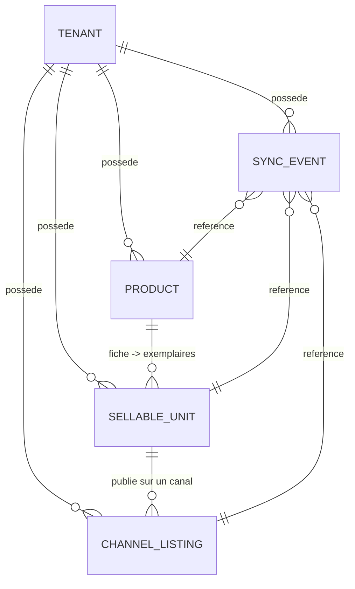

# Vinyl Backoffice — Strapi + Discogs

Tranche verticale d'un backoffice multi-tenant de gestion de vinyles avec publication sur la marketplace Discogs : séparation fiche catalogue / unité vendable / listing marketplace, connecteur Discogs mockable, logs de synchronisation persistants.

## Stack

| Composant | Techno | Dossier |
|---|---|---|
| Backend | Strapi 5 (TypeScript) + PostgreSQL 16 | [`backend/`](backend/) |
| Frontend démo | React + Vite (TypeScript) | [`frontend/`](frontend/) |
| Base de données | PostgreSQL via Docker Compose | [`docker-compose.yml`](docker-compose.yml) |

## Architecture



- **Product** : la fiche catalogue (titre, artiste, label, `discogsReleaseId`…). Une fiche, N exemplaires.
- **SellableUnit** : l'exemplaire physique vendu — SKU auto-généré (`VIN-000001`), prix, états disque/pochette, statut de vente.
- **ChannelListing** : l'annonce publiée sur un canal (`discogs`), avec `externalListingId`, statut et dernière synchro.
- **MarketplaceSyncEvent** : journal persistant de chaque opération (recherche, association, complétude, publication, vente, mise hors stock).
- Tous les objets portent un `tenant` et **toutes les requêtes métier sont scopées par tenant** (voir `backend/src/api/discogs/services/discogs.ts`).

La logique Discogs est isolée dans [`backend/src/lib/discogs/`](backend/src/lib/discogs/) derrière une interface `DiscogsConnector` avec deux implémentations choisies par variable d'environnement :

- **`DISCOGS_MODE=mock`** (défaut) : aucune requête réseau, catalogue de test embarqué (Daft Punk — Discovery, release `123456`).
- **`DISCOGS_MODE=real`** : recherche et lecture de releases via l'API Discogs (token requis). La **publication reste simulée même en mode réel** — on ne crée pas de vraies annonces sur la marketplace.

## Démarrage

Prérequis : Node.js ≥ 20, Docker.

```bash
# 1. PostgreSQL
docker compose up -d

# 2. Backend Strapi (http://localhost:1337)
cd backend
cp .env.example .env    # renseigner des secrets uniques (voir commentaires du fichier)
npm install
npm run develop

# 3. Frontend démo (http://localhost:5173) — dans un second terminal
cd frontend
npm install
npm run dev
```

Au premier lancement du backend :

- l'admin Strapi est sur http://localhost:1337/admin (création du premier compte au premier accès) ;
- un **seed idempotent** crée le tenant `Demo Records` avec une fiche « Daft Punk — Discovery » et un exemplaire prêt à publier. Les `documentId` sont affichés dans les logs de démarrage (`[seed] …`).

> Note démo : les endpoints du workflow et la lecture des modèles métier sont ouverts au rôle public pour dérouler le test sans token API (`backend/src/bootstrap/public-permissions.ts`). En production, ils seraient derrière une vraie gestion de rôles.

## Parcours de test

### Via le frontend (le plus rapide)

1. Ouvrir http://localhost:5173 — vue **Boutique (vendeur)**.
2. La fiche seedée « Daft Punk — Discovery » est sélectionnée : chercher la release (champ pré-rempli) puis **Associer** la release `123456`.
3. **Vérifier complétude** sur l'exemplaire (SKU `VIN-000001`, généré par le backend), puis **Publier sur Discogs**.
4. Passer sur l'onglet **Marketplace — simulation Discogs** : l'annonce `discogs-listing-0001` est en vente. Cliquer **Acheter**.
5. Retour vue vendeur : l'exemplaire est **Vendu**, et la timeline de droite montre tous les événements journalisés (recherche, association, complétude, publication, vente, mise hors stock).

### Via l'API

Le fichier [`backend/requests.http`](backend/requests.http) contient les appels dans l'ordre (extension VS Code REST Client, ou à copier dans Postman) :

| Étape | Endpoint |
|---|---|
| Recherche release | `GET /api/discogs/search?tenantId=…&q=…` |
| Association release | `POST /api/products/:id/attach-discogs-release` |
| Création exemplaire (SKU auto) | `POST /api/sellable-units` |
| Vérification complétude | `POST /api/sellable-units/:id/check-discogs-completeness` |
| Publication | `POST /api/sellable-units/:id/publish-discogs` |
| Listings publiés | `GET /api/discogs/listings?tenantId=…&status=published` |
| Simulation de vente | `POST /api/sellable-units/:id/simulate-discogs-sale` |
| Journal de synchro | `GET /api/marketplace-sync-events?sort=happenedAt:desc` |

### Workflow automatisé de bout en bout

Backend démarré :

```bash
cd backend
npm run e2e
```

Le script (`backend/scripts/e2e-workflow.mjs`) rejoue les 12 étapes du parcours — création de fiche, recherche, association, création d'unité, complétude, publication, vente simulée — et vérifie les statuts et les événements journalisés.

## Tests

```bash
cd backend
npm test
```

19 tests unitaires (Vitest) couvrent la génération de SKU, la validation de complétude Discogs et le connecteur mock. La CI GitHub Actions ([`.github/workflows/ci.yml`](.github/workflows/ci.yml)) exécute type-check + tests à chaque push.

## Variables d'environnement

Documentées dans [`backend/.env.example`](backend/.env.example) et [`frontend/.env.example`](frontend/.env.example). Aucun secret n'est versionné. Pour activer l'API Discogs réelle :

```
DISCOGS_MODE=real
DISCOGS_TOKEN=<token personnel Discogs (Settings > Developers)>
```

## Choix d'implémentation

- **SKU côté backend** : lifecycle `beforeCreate` de `sellable-unit` — toute valeur saisie est écrasée ; la contrainte d'unicité en base sert de garde-fou en cas de création concurrente.
- **Scoping tenant explicite** : chaque opération du service Discogs exige un `tenantId`, vérifie que le tenant existe et est actif, et filtre les entités par tenant — un objet d'un autre tenant renvoie 404.
- **Écritures Discogs toujours simulées** : même en mode réel, `publishListing` ne crée pas d'annonce — décision assumée pour un test technique (les lectures suffisent à prouver l'intégration).
- **Id de listing mock déterministe** : dérivé du SKU (`VIN-000001` → `discogs-listing-0001`) pour rester stable entre deux redémarrages.
- **Hors scope respecté** : pas de Fnac/Amazon/Stripe/commandes/BullMQ/S3, conformément à l'énoncé.
